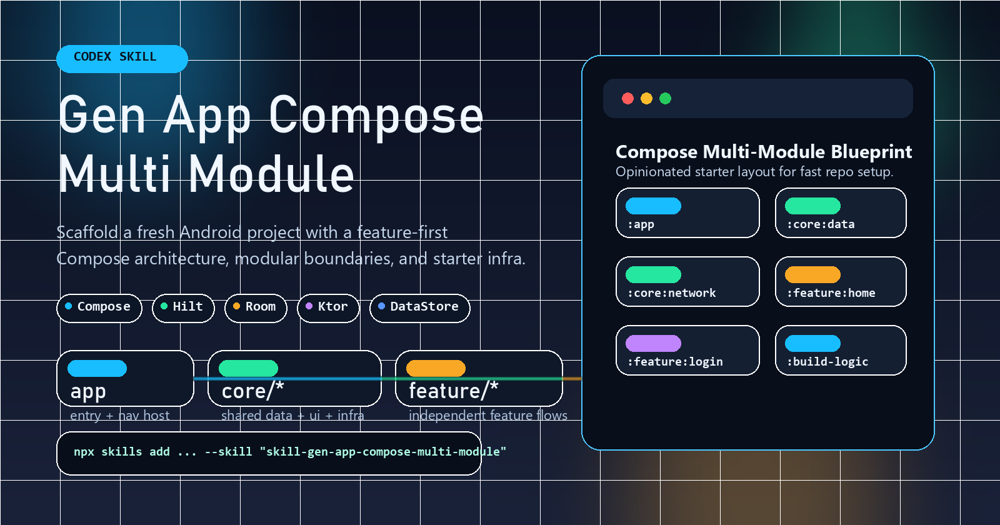
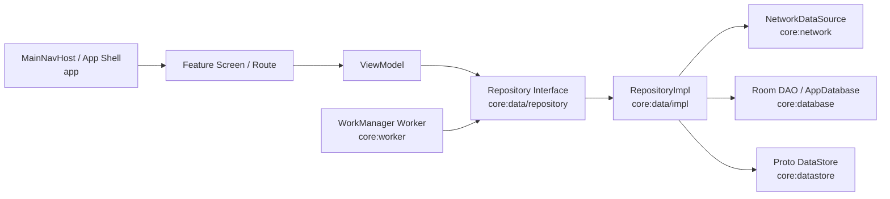

# Skill Build App Compose Multi Module

A Codex skill for scaffolding a brand-new Android project with a Compose-first multi-module architecture inspired.

## Layout

```text
skills/
  skill-gen-app-compose-multi-module/
    SKILL.md
    agents/
    references/
    scripts/
```

## Install

Install every skill in this repo:

```powershell
npx skills add https://github.com/baothanhbin/BinGen-SKill
```

Install only this skill:

```powershell
npx skills add https://github.com/baothanhbin/BinGen-SKill --skill "skill-gen-app-compose-multi-module"
```

Restart Codex after installation so the new skill is loaded.

## Manual Install

Copy this folder into your Codex skills directory:

```text
%USERPROFILE%\.codex\skills\skill-gen-app-compose-multi-module
```

Source folder:

```text
skills/skill-gen-app-compose-multi-module
```

## Usage

Basic trigger:

```text
Use $skill-gen-app-compose-multi-module to scaffold a new Android project with a Compose multi-module architecture.
```

Recommended prompt with feature and screen details:

```text
Use $skill-gen-app-compose-multi-module to scaffold a new Android project.

Project:
- App name: PlantCareAI
- Package: com.baothanhbin.plantcareai
- Slug: plantcareai

Features:
- home
- login
- diagnosis
- reminders
- profile

Screens:
- Splash
- Login
- Home
- DiagnosisHistory
- DiagnosisDetail
- ReminderList
- ReminderDetail
- Profile

Navigation flow:
- start at login if signed out
- go to home after login
- home, diagnosis, reminders, and profile are top-level destinations
- detail screens pop back to their parent screens

Core models:
- User
- Session
- Plant
- DiagnosisResult
- Reminder

Repositories:
- AuthRepository
- PlantRepository
- DiagnosisRepository
- ReminderRepository

Data layer:
- Ktor for remote APIs
- Room for local entities
- Proto DataStore for auth/session

Background work:
- WorkManager enabled
- SyncPlantsWorker
- SyncRemindersWorker

Scaffold the project in the current working directory.
```

If you want a faster minimum prompt, provide at least:

- project name
- package
- slug
- starter features
- main screens
- whether to enable Hilt, Room, DataStore, Ktor, and WorkManager

## Architecture Flow



The intended dependency direction is:

- `feature/*` depends on `core:data` contracts, not on `core:network`, `core:database`, or `core:datastore` directly.
- Hilt binds `Repository` interfaces to `RepositoryImpl` implementations in `core:data/di`.
- `RepositoryImpl` coordinates local and remote sources.
- `core:worker` reuses repository contracts for background sync instead of talking to feature UI code.
